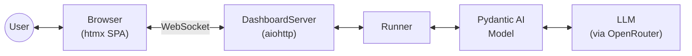
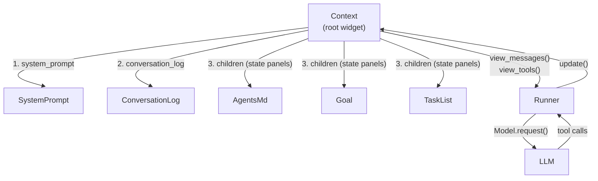

# Architecture Overview

Calipso is a context engineering library and CLI agent. It uses Pydantic AI's `Model` layer for provider-agnostic LLM communication but owns the agentic loop and prompt composition entirely.

## Widgets and the Context

Everything the model sees is composed from **widgets** — Elm Architecture components with state, view functions, and update handlers. Widgets compose via nesting: a parent widget calls child views with `yield from`, which naturally flattens (List monad join). The root widget is the **Context**, which composes all children into the final prompt.

Each widget:

- **Holds state** as dataclass fields
- **Renders via view functions** — generators yielding messages (`view_messages()`), tool definitions (`view_tools()`), or HTML (`view_html()`)
- **Handles updates** — tool calls dispatched by the Context mutate widget state

Tools are not a separate concept — they are just another view (`view_tools() -> Iterator[ToolDefinition]`), composed the same way as messages. HTML is a third view: `view_html()` renders the widget as a browser panel, pushed to connected clients via WebSocket after every state mutation. Compaction is a view decision: the widget always has full state, but each view decides what to show.

## The Runner

The runner is a thin agentic loop that only talks to the Context:

1. Materialize `context.view_messages()` and `context.view_tools()`
2. Call `Model.request()` with the composed prompt
3. Pass the response to `context.handle_response()` which dispatches tool calls to owning widgets
4. If an `on_update` callback is provided, call it after every state mutation (used by the dashboard to push HTML)
5. Loop while the model makes tool calls; return text when done

## Browser Dashboard

The agent runs a live browser dashboard alongside the agentic loop. A `DashboardServer` (aiohttp) serves an htmx SPA and maintains WebSocket connections. After every widget state change, the Context computes which widgets' `view_html()` output changed (via string comparison against a cache) and the server pushes only the changed HTML fragments using htmx's out-of-band swap mechanism (`hx-swap-oob`). Each widget has a stable HTML element ID derived from its class name.

The browser is both an input and interaction channel. User messages are sent via WebSocket as `{"user_input": "..."}` and enqueued for the runner. Widgets can also declare **frontend tools** — a subset of their tools callable directly from the browser via `{"widget_event": {"tool_name": "...", "args": {...}}}` messages. Frontend events bypass the LLM and action log protocol, calling the widget's `update()` method directly and pushing the resulting HTML changes back. This allows widgets to render interactive HTML (buttons, checkboxes, forms) that mutate their own state without an LLM round-trip. During a turn, the dashboard shows a thinking indicator and disables the input.

All widget HTML output is rendered through a shared `render_md()` function that converts markdown to safe HTML (raw HTML in input is escaped before markdown processing).

## Current state

The agent has five widgets: `SystemPrompt` (static identity/framing text), `AgentsMd` (behavioral instructions loaded from `AGENTS.md`), `Goal` (directional — set/clear, editable from browser), `TaskList` (organizational — CRUD with interactive checkboxes and remove buttons), and `ConversationLog` (manages user/assistant turns partitioned into segments with action log protocol enforcement — summarized segments render a summary plus tool call/return messages, unsummarized segments render full messages).

The Context renders in a specific order: system prompt first, then conversation history, then state panels (wrapped in `CURRENT STATE` / `END STATE` markers as user messages) so the model sees live state right before generating its response.
