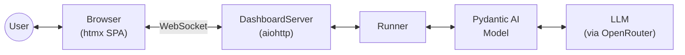
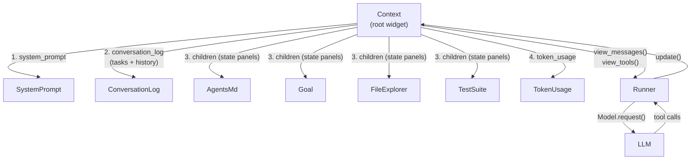

# Architecture Overview

Calipso is a context engineering library and CLI agent. It uses Pydantic AI's `Model` layer for provider-agnostic LLM communication but owns the agentic loop and prompt composition entirely.

## Widgets and the Context

Everything the model sees is composed from **widgets** — Elm Architecture components with state, view functions, and update handlers. Widgets compose via nesting: a parent widget calls child views with `yield from`, which naturally flattens (List monad join). The root widget is the **Context**, which composes all children into the final prompt.

Each widget:

- **Holds state** as frozen dataclass fields
- **Renders via view functions** — generators yielding messages (`view_messages()`), tool definitions (`view_tools()`), or HTML (`view_html()`)
- **Handles updates via pure functions** — `update(model, msg) → (model, Cmd)` returns the new state plus a `Cmd` describing any side effect. The runtime executes the Cmd loop (effect → Msg → update → …) until no more effects remain

Tools are not a separate concept — they are just another view (`view_tools() -> Iterator[ToolDefinition]`), composed the same way as messages. HTML is a third view: `view_html()` renders the widget as a browser panel, pushed to connected clients via WebSocket after every state mutation. Compaction is a view decision: the widget always has full state, but each view decides what to show.

## The Runner

The runner is a thin agentic loop that only talks to the Context:

1. Materialize `context.view_messages()` and `context.view_tools()`
2. Call `Model.request()` with the composed prompt
3. Pass the response to `context.handle_response()` which dispatches tool calls to owning widgets
4. If an `on_update` callback is provided, call it after every state mutation (used by the dashboard to push HTML)
5. Loop while the model makes tool calls; return text when done

## Browser Dashboard

The agent runs a live browser dashboard alongside the agentic loop. A `DashboardServer` (aiohttp) serves an htmx SPA and maintains WebSocket connections. After every widget state change, the Context computes which widgets' `view_html()` output changed (via string comparison against a cache) and the server pushes only the changed HTML fragments using htmx's out-of-band swap mechanism (`hx-swap-oob`). Each widget has a stable HTML element ID derived from its class name.

The browser is both an input and interaction channel. User messages are sent via WebSocket as `{"user_input": "..."}` and enqueued for the runner. Widgets can also declare **frontend tools** — a subset of their tools callable directly from the browser via `{"widget_event": {"tool_name": "...", "args": {...}}}` messages. Frontend events bypass the LLM and the task protocol, running through the same `from_ui → update → Cmd loop` path and pushing the resulting HTML changes back. Messages that can originate from both the LLM and the browser carry an `initiator: Initiator` field so `update` knows whether to produce a tool response (`CmdToolResult`) or not (`CmdNone`). This allows widgets to render interactive HTML (buttons, checkboxes, forms) that mutate their own state without an LLM round-trip. During a turn, the dashboard shows a thinking indicator and disables the input.

All widget HTML output is rendered through a shared `render_md()` function that converts markdown to safe HTML (raw HTML in input is escaped before markdown processing).

## Current state

The default widget tree has seven widgets: `SystemPrompt` (static identity/framing text), `AgentsMd` (behavioral instructions loaded from `AGENTS.md`), `Goal` (directional — set/clear, editable from browser; its tools are declared *protocol-free* so they remain callable with no active task), `ConversationLog` (tasks + conversation history in one widget — enforces the task protocol, owns the chronological log of user messages / LLM responses / tool results, each tagged with the task that owned them; done-task spans collapse to a memory-only block for the LLM), `FileExplorer` (directory listing and file reading), `TestSuite` (configurable test runner with subprocess tracking and cancellation), and `TokenUsage` (display-only bar chart of input/output tokens per LLM request). A `CodeExplorer` widget (tree-sitter-based code reading with LLM-generated `[...REDACTED...]` body summaries) is available in the codebase but is currently not wired into the default tree.

The Context renders in a specific order: system prompt first, then the `ConversationLog` (protocol rules + chronological log with done-task collapsing + open-tasks block), then state panels (wrapped in `CURRENT STATE` / `END STATE` markers as user messages) so the model sees live state right before generating its response.

## Task protocol

`ConversationLog` partitions the conversation by **tasks**. A task moves through `PENDING → IN_PROGRESS → DONE`, and only one task may be `IN_PROGRESS` at a time. The protocol has six LLM tools (`create_task`, `start_task`, `task_memory`, `close_current_task`, `task_pick`, `remove_task`) plus UI-only affordances for editing/removing memories and toggling visual expansion. Key rules:

- **Every non-task, non-goal tool call requires an `IN_PROGRESS` task.** `set_goal` / `clear_goal` are declared *protocol-free* via a `create_widget(protocol_free_tools=…)` parameter and remain callable with no active task; everything else is rejected outside a task.
- **`close_current_task` must be the first and only tool call** in its response (mirrors the previous `end_step` rule) — the LLM must have seen all tool results before closing. Closing requires at least one memory.
- **Once a task is `DONE`, its span collapses** for future prompts into a system-prompt block containing the task id, description, and LLM-authored memories. The raw tool calls/results are no longer visible to the LLM.
- **`task_pick(task_id)` re-expands a done task's full log for exactly one `Model.request()`** — a single-round-trip escape hatch. The Context clears the pick set at the start of the next `handle_response`.
- **`in_progress` persists across user turns.** A mid-task user message is appended to the active task's log; the task is only closed when the LLM explicitly calls `close_current_task`.
- **Only `PENDING` tasks can be removed.** `IN_PROGRESS` and `DONE` tasks are frozen — their log/memories cannot be erased.

The UI renders the open-tasks list and per-task controls inline in the chat flow, with a separate visual expand/collapse (`ui_expanded`) on done tasks that is fully independent of what the LLM sees. A 🔍 marker indicates a task the LLM has picked for expansion on the next request.
