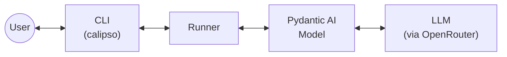
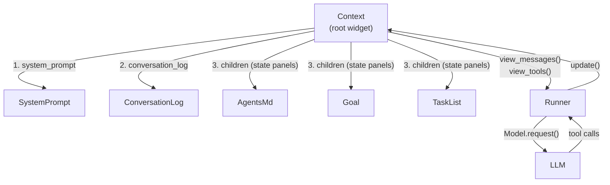

# Architecture Overview

Calipso is a context engineering library and CLI agent. It uses Pydantic AI's `Model` layer for provider-agnostic LLM communication but owns the agentic loop and prompt composition entirely.

## Widgets and the Context

Everything the model sees is composed from **widgets** — Elm Architecture components with state, view functions, and update handlers. Widgets compose via nesting: a parent widget calls child views with `yield from`, which naturally flattens (List monad join). The root widget is the **Context**, which composes all children into the final prompt.

Each widget:

- **Holds state** as dataclass fields
- **Renders via view functions** — generators yielding messages (`view_messages()`) or tool definitions (`view_tools()`)
- **Handles updates** — tool calls dispatched by the Context mutate widget state

Tools are not a separate concept — they are just another view (`view_tools() -> Iterator[ToolDefinition]`), composed the same way as messages. Compaction is a view decision: the widget always has full state, but the view decides what to show (expanded vs collapsed).

## The Runner

The runner is a thin agentic loop that only talks to the Context:

1. Materialize `context.view_messages()` and `context.view_tools()`
2. Call `Model.request()` with the composed prompt
3. Pass the response to `context.handle_response()` which dispatches tool calls to owning widgets
4. Loop while the model makes tool calls; return text when done

## Current state

The agent has a CLI entry point and five widgets: `SystemPrompt` (static identity/framing text), `AgentsMd` (behavioral instructions loaded from `AGENTS.md`), `Goal` (directional — set/clear), `TaskList` (organizational — CRUD), and `ConversationLog` (manages user/assistant turns partitioned into segments with action log protocol enforcement — summarized segments render a model-provided summary, unsummarized segments render full messages).

The Context renders in a specific order: system prompt first, then conversation history, then state panels (wrapped in `CURRENT STATE` / `END STATE` markers) so the model sees live state right before generating its response.
