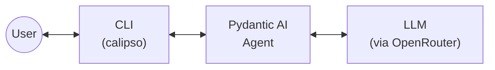
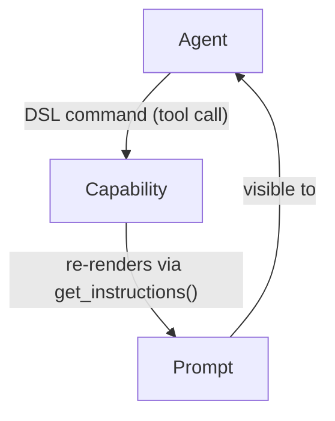

# Architecture Overview

Calipso is a Python CLI application built on Pydantic AI. The agent talks to an LLM and has a set of capabilities whose state is rendered into every prompt.

## How capabilities fit in

Capabilities are Pydantic AI `AbstractCapability` subclasses. They are stateful programs that produce text via `get_instructions()`, and that text is injected into the agent's prompt. The agent manipulates capabilities by issuing DSL commands (exposed as tools via `get_toolset()`), which change the capability's internal state and therefore change what appears in the next prompt.

## Current state

The agent has a CLI entry point and three capabilities: `SystemPrompt` (static text), `TaskList` (organizational — tracks tasks with create/update/remove tools), and `Goal` (directional — keeps the agent focused with set/clear tools). TaskList and Goal are the first DSL-bearing capabilities, demonstrating the pattern of stateful capabilities with tools that mutate internal state and dynamic `get_instructions()` rendering.
